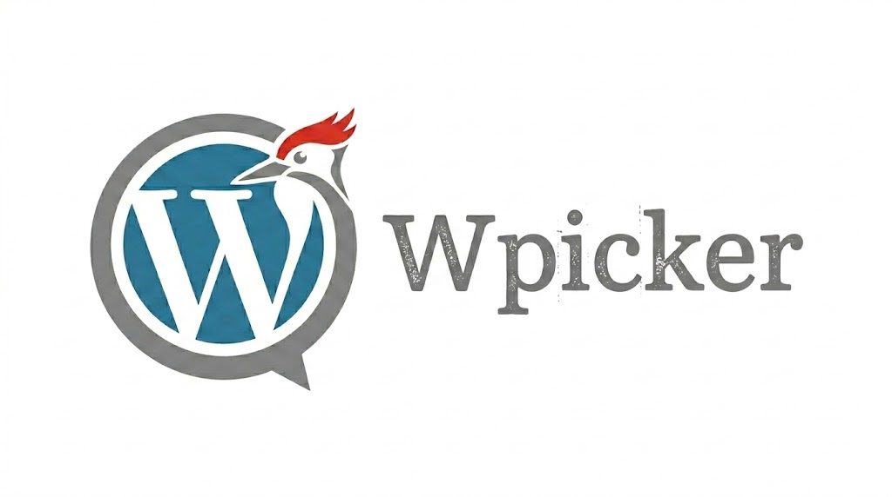

<p align="center">
  
</p>

# WPicker: AI-Native WordPress Bridge
[](LICENSE)
[](https://golang.org)
[](https://php.net)

**WPicker** (v1.1.0) is a modern bridge between local AI agents and live WordPress sites. It turns WordPress into an AI-native environment by providing secure auth, file synchronization, atomic snapshots, rollback capabilities, and a self-healing lint gate.

[🚀 Installation](#-quick-installation) • [📖 Documentation](#-documentation) • [✨ Features](#-key-features) • [🏗️ Architecture](#-architecture)

---

## ✨ Key Features
- **Self-Healing Lint Gate** - Automatically runs `php -l` on pushed code, rejecting syntax errors and returning structured data for AI to fix.
- **Atomic Snapshots & Rollback** - Every push creates an atomic snapshot. Instantly restore any prior state if business logic breaks.
- **AI Context Fetching** - Fetch WordPress metadata, plugin states, and `theme_mods` as AI-friendly JSON to prevent hallucination.
- **Secure PIN Auth** - Securely bootstrap connections using a 6-digit PIN and Application Passwords—no main admin password required.
- **Path Guardrails** - Hard-restricted strictly to child themes, preventing accidental destruction of core files or parent themes.
- **Zero DB Writes** - Completely read-only for databases, ensuring content integrity during AI operations.

## 💻 System Requirements
- **Local/Agent:** Go v1.21+ (for building CLI from source), Node 18+ & Docker (for local dev)
- **Server:** PHP 7.4+ with CLI `php` available in PATH
- **WordPress:** Active Child Theme

## ⚡ Quick Installation

### One-Liner Install (macOS/Linux)
The quickest way to install the CLI globally for you or your AI agent:
```bash
curl -sL https://raw.githubusercontent.com/febritecno/wpicker/main/install.sh | bash -s -- install
```
*(To uninstall, simply change `install` to `remove`)*

## 🏗️ Architecture

```text
   ┌──────────────────────────┐         ┌──────────────────────────┐
   │   THE EYES  (plugin)     │  HTTPS  │   THE HANDS  (Go CLI)    │
   │  REST API + Vault + Lint │ ◀────── │  login / pull / push     │
   └──────────────────────────┘  REST   └──────────────────────────┘
        WordPress side                       Local / AI agent side
```

### Repository Layout
```text
wpicker/
├── plugin/   # PHP plugin ("The Eyes") — REST API, Vault, lint gate, admin UI
├── cli/      # Go CLI ("The Hands") — cobra commands, REST client
├── local-dev/wpicker-child/  # stub child theme for dev
└── .wp-env.json              # wp-env config
```

## 🚀 Usage Guide

```bash
# 1. Connect to your live site
wpicker login https://your-production-site.com

# 2. Fetch context to inform your AI agent
wpicker context

# 3. Pull latest child theme files
wpicker theme pull

# ... (Edit files locally or via AI) ...

# 4. Push changes safely (will run php -l gate on server)
wpicker theme push

# 5. View deployment history and snapshots
wpicker history

# 6. Rollback if needed
wpicker rollback <manifest-id>
```

## 📖 Documentation

- **Production Deployment:** See [`DEPLOYMENT.md`](DEPLOYMENT.md) for full instructions on installing the plugin on live servers.
- **AI Agent Integration:** This repo includes a `.cursorrules` file that auto-configures Cursor/Claude to use WPicker properly.
- **PRD:** See [`PRD.md`](PRD.md) for the full product requirements.
- **REST Contract:** [`plugin/includes/REST/`](plugin/includes/REST/).
- **CLI Commands:** [`cli/cmd/`](cli/cmd/).

## 📜 License

GPL-2.0-or-later (WordPress convention).
